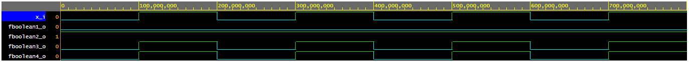
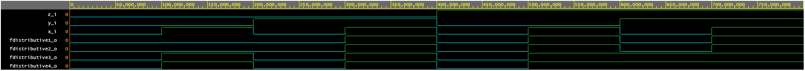

# 01-gates
## EDA playground link
[LINK](https://www.edaplayground.com/x/KnHh)
## VHDL code
```vhdl
architecture dataflow of gates is
begin
    f_o  <= ((not b_i) and a_i) or ((not c_i) and (not b_i));
    fnand_o <= ((not b_i) nand a_i) nand ((not c_i) nand (not b_i));
    fnor_o <= b_i nor (a_i nor (not c_i));
    fboolean1_o <= x_i and (not x_i);
    fboolean2_o <= x_i or (not x_i);
    fboolean3_o <= x_i or x_i or x_i;
    fboolean4_o <= x_i and x_i and x_i;
    fdistributive1_o <= (x_i and y_i) or (x_i and z_i);
    fdistributive2_o <= x_i and (y_i or z_i);
    fdistributive3_o <= (x_i or y_i) and (x_i or z_i);
    fdistributive4_o <= x_i or (y_i and z_i);

end architecture dataflow;
```
### Functions

#### Table
| **c** | **b** |**a** | **f(c,b,a)** |
| :-: | :-: | :-: | :-: |
| 0 | 0 | 0 | 1 |
| 0 | 0 | 1 | 1 |
| 0 | 1 | 0 | 0 |
| 0 | 1 | 1 | 0 |
| 1 | 0 | 0 | 0 |
| 1 | 0 | 1 | 1 |
| 1 | 1 | 0 | 0 |
| 1 | 1 | 1 | 0 |

#### Time waveforms


### Boolean pustulates

#### Time waveforms


### Distributive laws

#### Time waveforms

